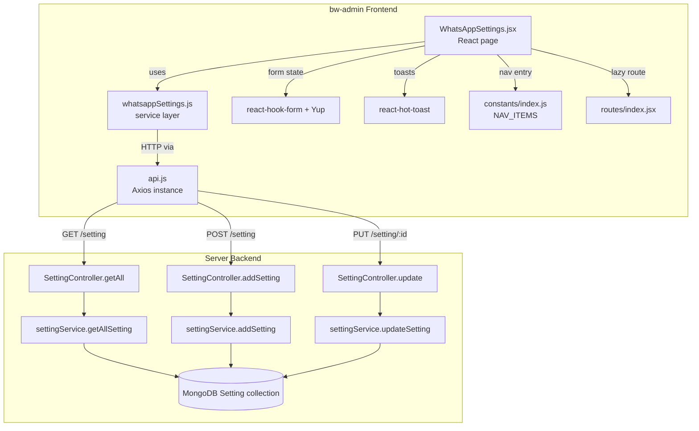

# Design Document: WhatsApp Settings

## Overview

This feature adds a WhatsApp Settings administration page to the bw-admin panel. Admins can view and edit two configuration values — a WhatsApp phone number (`whatsapp_number`) and a WhatsApp channel URL (`whatsapp_channel_url`) — stored as key/value documents in the existing MongoDB `Setting` collection.

The feature reuses all existing infrastructure:

- **Frontend**: React + Vite + Tailwind, react-hook-form + Yup for form handling, react-hot-toast for notifications, the central Axios instance in `api.js`, Framer Motion for animations, and existing UI components (`Card`, `Input`, `Button`, `PageHeader`).
- **Backend**: Express + Mongoose with the existing `Setting` model and `/setting` routes. Three targeted fixes are required: (1) update the Joi validation middleware to accept string values, (2) fix `updateSetting` to return the new document and raise 404 when not found, and (3) add 409 conflict detection in `addSetting`.

No new dependencies are introduced on either the frontend or backend.

---

## Architecture

The feature follows the existing layered architecture of bw-admin.



**Request flow for page load:**
1. Component mounts → `fetchSettings()` calls `GET /setting`
2. Response array is scanned for `whatsapp_number` and `whatsapp_channel_url` keys
3. Matching values are written into the form via `react-hook-form`'s `reset()`

**Request flow for save:**
1. Form submit → Yup schema validates both fields
2. For each setting key (`whatsapp_number`, `whatsapp_channel_url`):
   - If the loaded settings array included an `_id` for the key → `PUT /setting/:id`
   - If the key was absent (no record in DB) → `POST /setting`
3. Both requests run in parallel via `Promise.allSettled`
4. Results produce a unified success or error toast

---

## Components and Interfaces

### New files

#### `src/pages/whatsapp-settings/WhatsAppSettings.jsx`

Single-page component. No sub-components are needed given the small form size.

| Responsibility | Implementation |
|---|---|
| Fetch settings on mount | `useEffect` → `fetchSettings()` |
| Pre-populate form | `form.reset({ whatsapp_number, whatsapp_channel_url })` |
| Validate on submit | Yup schema (E.164 phone, URL with scheme+host) |
| Submit handler | `saveSettings(ids, data)` — PUT or POST per field |
| Loading state | `isFetching` (initial load) + `isSaving` (submit) |
| Notifications | `toast.success` / `toast.error` from `react-hot-toast` |
| Animation | `<motion.div {...fadeInUp}>` wrapper |

```jsx
// Simplified component signature
export default function WhatsAppSettings() { ... }
```

Internal state:
```js
const [isFetching, setIsFetching] = useState(true)
const [isSaving, setIsSaving]     = useState(false)
const [settingIds, setSettingIds] = useState({ whatsapp_number: null, whatsapp_channel_url: null })
```

#### `src/services/whatsappSettings.js`

Thin Axios wrapper. Mirrors the `setRate.js` pattern.

```js
import api from './api'

export const fetchSettings  = ()           => api.get('/setting')
export const createSetting  = (payload)    => api.post('/setting', payload)
export const updateSetting  = (id, payload) => api.put(`/setting/${id}`, payload)
```

### Modified files

#### `src/constants/index.js`

Append one entry to `NAV_ITEMS`:

```js
{
  id: 'whatsapp-settings',
  title: 'WhatsApp Settings',
  icon: 'MessageCircle',
  path: '/whatsapp-settings',
}
```

#### `src/routes/index.jsx`

Add lazy import and protected route:

```jsx
const WhatsAppSettings = lazy(() => import('@/pages/whatsapp-settings/WhatsAppSettings'))
// inside the protected Route block:
<Route path="/whatsapp-settings" element={<WhatsAppSettings />} />
```

#### `Server/middleware/validations/config.validation.js`

Replace the existing `createConfigValidation` with a corrected schema. The old schema requires `id: number` and `value: number`, which is wrong for string-based settings.

New schema (POST body):
```js
Joi.object({
  key:   Joi.string().max(255).required(),
  value: Joi.string().max(255).required(),
})
```

Add a separate `updateConfigValidation` for PUT (only `value` is required in the body; `id` comes from `req.params`):
```js
Joi.object({
  value: Joi.string().max(255).required(),
})
```

Apply `updateConfigValidation` to the `PUT /:id` route in `routes/setting.js`.

#### `Server/services/setting.js`

Fix `updateSetting`:
- Add `{ new: true }` to `findOneAndUpdate` so the updated document is returned.
- Check the result; if `null`, set `response.status = 404` and `response.success = false`.

Fix `addSetting`:
- Before creating, call `Setting.findOne({ key: payload.key })`. If a document is found, return a 409 conflict response without creating.

#### `Server/controllers/setting.controller.js`

No logic changes required beyond what the service layer now handles. The controller already propagates `response.status` to `res.status(response.status).json(response)`, so the 404 and 409 statuses set in the service layer will flow through correctly.

---

## Data Models

### MongoDB: `Setting` document

```
{
  _id:       ObjectId   (auto-generated)
  key:       String     (required, unique by convention: "whatsapp_number" | "whatsapp_channel_url")
  value:     String     (required)
  createdAt: Date       (auto via timestamps)
  updatedAt: Date       (auto via timestamps)
}
```

No schema changes are needed. The model already defines `key` and `value` as required strings.

### Frontend: form state

```ts
{
  whatsapp_number:      string   // E.164-compatible phone: /^\+?[0-9]{7,15}$/
  whatsapp_channel_url: string   // URL with http/https scheme and non-empty host
}
```

### Frontend: setting ID tracking

Held in component state — not persisted:

```ts
settingIds: {
  whatsapp_number:      string | null   // MongoDB _id if record exists, else null
  whatsapp_channel_url: string | null
}
```

### API response shape

`GET /setting` returns:
```json
{
  "success": true,
  "message": "Setting fetched successfully",
  "status": 200,
  "data": [
    { "_id": "...", "key": "whatsapp_number",      "value": "+1234567890" },
    { "_id": "...", "key": "whatsapp_channel_url", "value": "https://wa.me/channel/..." }
  ]
}
```

`POST /setting` returns 201; `PUT /setting/:id` returns 200; both return the document in `data`.

---

## Correctness Properties

*A property is a characteristic or behavior that should hold true across all valid executions of a system — essentially, a formal statement about what the system should do. Properties serve as the bridge between human-readable specifications and machine-verifiable correctness guarantees.*

### Property 1: Settings key-to-field mapping

*For any* array of Setting objects returned from the API, the form field for a given key (`whatsapp_number` or `whatsapp_channel_url`) should be pre-populated with the value of the matching object, and left empty when no matching object is present.

**Validates: Requirements 1.2, 1.3, 1.6**

### Property 2: URL validation rejects non-http(s) or missing host

*For any* string that does not begin with `http://` or `https://`, or that has an empty host component, the Yup schema SHALL classify it as invalid and produce the message "Enter a valid URL". Conversely, *for any* string that begins with `http://` or `https://` and has a non-empty host, the schema SHALL classify it as valid.

**Validates: Requirements 2.5**

### Property 3: E.164 phone validation

*For any* string that matches the pattern `/^\+?[0-9]{7,15}$/`, the Yup schema SHALL classify it as valid. *For any* string that does not match that pattern (including empty strings, strings with letters, strings shorter than 7 digits, or strings longer than 15 digits), the schema SHALL classify it as invalid and produce the message "Enter a valid phone number".

**Validates: Requirements 2.6**

### Property 4: Invalid input never reaches the API

*For any* form submission where either field fails the Yup validation rules (invalid phone format or invalid URL), zero API calls SHALL be dispatched by the service layer.

**Validates: Requirements 3.3**

### Property 5: PUT→POST fallback for absent records

*For any* setting key (`whatsapp_number` or `whatsapp_channel_url`), when the service attempts a `PUT /setting/:id` and receives a 404 response, the service SHALL subsequently send a `POST /setting` request with that key and the new value.

**Validates: Requirements 3.7**

### Property 6: GET /setting returns all documents faithfully

*For any* collection state containing N Setting documents (including N = 0), `GET /setting` SHALL return a successful response whose `data` array has exactly N elements, and each element SHALL contain at minimum a `key` field and a `value` field matching the stored document.

**Validates: Requirements 5.1, 5.2, 5.3, 5.4**

### Property 7: POST /setting round-trip preserves key and value

*For any* valid non-empty key string (≤ 255 characters) and valid non-empty value string (≤ 255 characters), a `POST /setting` request SHALL return HTTP 201 and a response whose `data.key` equals the submitted key and `data.value` equals the submitted value.

**Validates: Requirements 6.1**

### Property 8: PUT /setting/:id returns the updated value

*For any* existing Setting document and any new valid value string, a `PUT /setting/:id` request with the new value SHALL return HTTP 200 and a response whose `data.value` equals the new value (not the old value).

**Validates: Requirements 6.2**

---

## Error Handling

| Scenario | Backend behaviour | Frontend behaviour |
|---|---|---|
| `GET /setting` server error | Returns `{ success: false, status: 500 }` | `toast.error('Failed to load settings')` |
| `PUT /setting/:id` — ID not found | Returns `{ success: false, status: 404 }` | Service retries with `POST /setting` |
| `POST /setting` — duplicate key | Returns `{ success: false, status: 409 }` | Service treats as error; `toast.error(...)` |
| `POST /setting` — missing key/value | Returns `{ success: false, status: 400 }` from Joi middleware | `toast.error(err.response.data.message)` |
| `PUT /setting/:id` — missing/empty value | Returns `{ success: false, status: 400 }` from Joi middleware | `toast.error(err.response.data.message)` |
| Both PUT/POST succeed | — | `toast.success('WhatsApp settings updated successfully')` |
| One request fails, one succeeds | Partial success | `toast.error('Failed to update some settings')` — the successful setting is retained |
| Yup validation fails on submit | — | Inline field errors, no API call |
| Network timeout / 5xx | Global API interceptor shows `'Server error. Please try again later.'` | isSaving reset to false |

---

## Testing Strategy

### Dual testing approach

Unit/integration tests handle concrete examples, edge cases, and error flows. Property-based tests verify universal properties across all inputs.

### Property-based testing

The selected library is **fast-check** (JavaScript), which integrates with Vitest without additional configuration.

Each property test runs a minimum of 100 iterations (fast-check default: 100).

Tag format for referencing design properties in test code:
```
// Feature: whatsapp-settings, Property N: <property_text>
```

**Properties mapped to tests:**

| Property | Test file | What fast-check generates |
|---|---|---|
| P1: Key-to-field mapping | `whatsappSettings.service.test.js` | Random arrays of Setting objects, with/without target keys |
| P2: URL validation | `validationSchema.test.js` | Strings with/without http(s) scheme and host |
| P3: E.164 phone validation | `validationSchema.test.js` | Strings matching/not matching E.164 regex |
| P4: Invalid input never calls API | `WhatsAppSettings.component.test.jsx` | Invalid phone/URL strings |
| P5: PUT→POST fallback | `whatsappSettings.service.test.js` | Setting keys; mock PUT returns 404 |
| P6: GET returns all docs | `setting.service.test.js` (backend) | N random Setting docs (N: 0–50) |
| P7: POST round-trip | `setting.service.test.js` (backend) | Random valid key/value string pairs |
| P8: PUT returns updated value | `setting.service.test.js` (backend) | Existing docs + random new value strings |

### Unit / example-based tests

**Frontend:**
- Component mounts and calls `GET /setting` (Req 1.1)
- Loading state disables submit button (Req 1.4, 3.4)
- Toast on fetch error (Req 1.5)
- Toast on save success / partial failure (Req 3.5, 3.6)
- Unauthenticated redirect to `/login` (Req 4.3)
- `NAV_ITEMS` contains the whatsapp-settings entry (Req 4.1)

**Backend:**
- `PUT /setting/:id` with non-existent ID returns 404 (Req 6.3)
- `POST /setting` without `key` returns 400 (Req 6.4)
- `POST /setting` without `value` returns 400 (Req 6.5)
- `PUT /setting/:id` with empty `value` returns 400 (Req 6.6)
- `POST /setting` with duplicate `key` returns 409 (Req 6.7)
- `GET /setting` with DB error returns 500 (Req 5.5)
